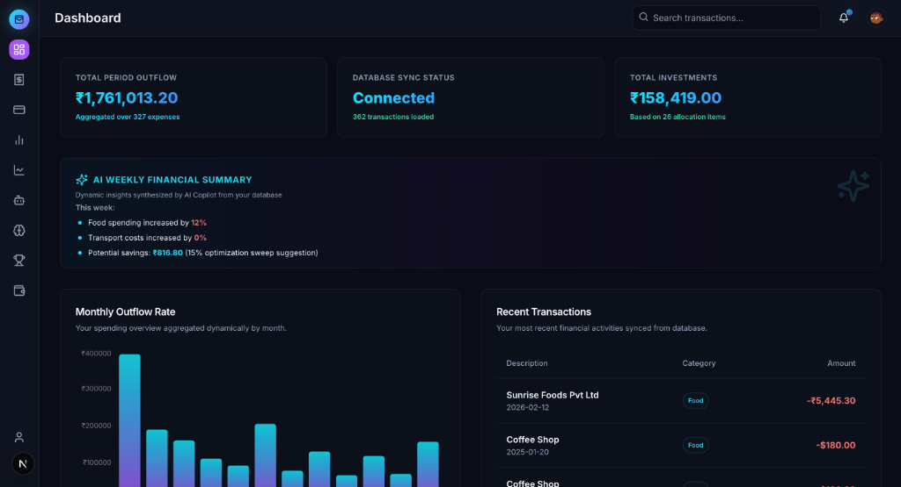
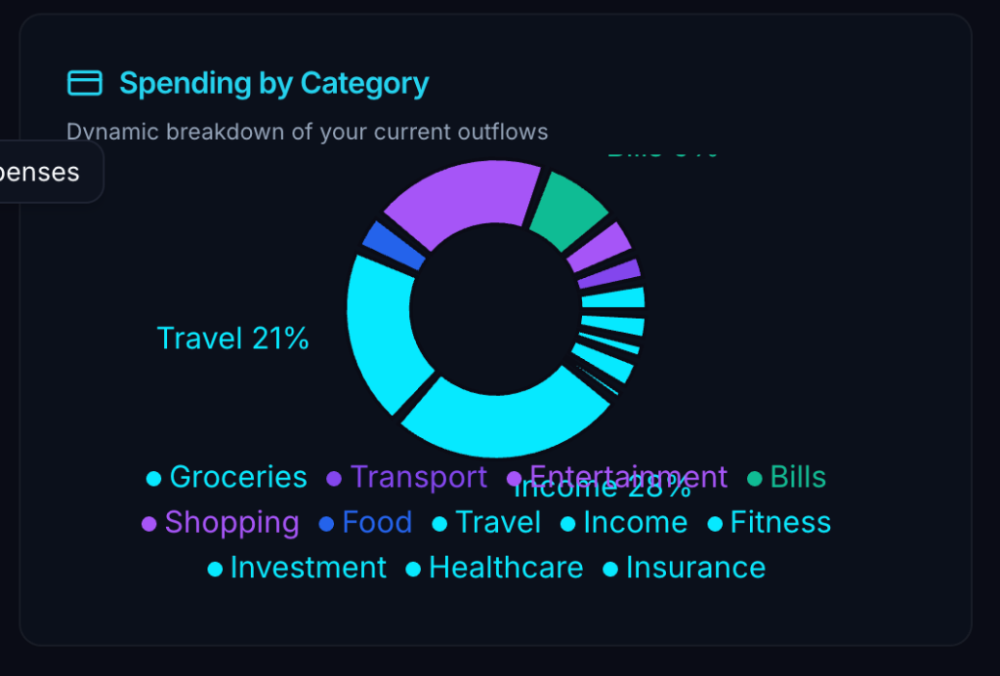

# IntelliSpend AI 💰

**IntelliSpend AI** is a modern, AI-powered personal finance web application built with Next.js. It provides intelligent tools to help you track expenses, gain financial insights, and get smart investment advice.



## ✨ Core Features

- **🤖 AI Financial Assistant**: Ask questions about your spending habits in plain English (e.g., "Where did I spend most?") and get instant, data-driven answers.
- **🧾 Intelligent Receipt Scanner**: Automatically extract details like vendor, date, and total amount from uploaded receipt images using AI-powered Optical Character Recognition (OCR).
- **📈 Smart Investment Recommendations**: Receive personalized investment suggestions based on your financial data and risk profile.
- **📊 Interactive Dashboard**: Visualize your monthly spending, savings goals, and investment opportunities in one central place.
- **🗂️ Receipt & Expense Tracker**: Keep an organized, searchable vault of all your past receipts and track expenses with automatic categorization.
- **💳 Digital Wallet Passes**: Generate and share summaries of your receipts, budget tips, or investment plans.

## 📸 Screenshots & Walkthrough

### 1. Dynamic Wealth Dashboard


### 2. Gamification & Rewards Hub


## 🛠️ Technology Stack

- **Framework**: [Next.js](https://nextjs.org/) (using App Router)
- **AI**: Advanced Large Language Models (LLMs) & Agentic AI Engines
- **Styling**: [Tailwind CSS](https://tailwindcss.com/)
- **UI Components**: [shadcn/ui](https://ui.shadcn.com/)

## 🚀 Getting Started

Follow these steps to get the project running in your local environment.

### Prerequisites

- Node.js (v18 or later)
- npm or yarn

### Installation & Setup

1.  **Clone the repository:**
    ```bash
    git clone https://github.com/youmeeuss/IntelliSpend-AI.git
    cd IntelliSpend-AI
    ```

2.  **Install dependencies:**
    ```bash
    npm install
    ```

3.  **Set up your environment variables:**
    - Create a file named `.env.local` in the root of the project.
    - Add your AI API key to this file.
    ```
    GOOGLE_API_KEY=YOUR_API_KEY_HERE
    ```
    _**Note:** The API key is loaded securely and is not exposed on the client side._

4.  **Run the development server:**
    ```bash
    npm run dev
    ```

Open [http://localhost:9002](http://localhost:9002) in your browser to see the application.

## 🤝 How to Contribute

Contributions are welcome! If you have suggestions or want to improve the code, please feel free to:

1.  Fork the repository.
2.  Create a new branch (`git checkout -b feature/YourAmazingFeature`).
3.  Commit your changes (`git commit -m 'Add some AmazingFeature'`).
4.  Push to the branch (`git push origin feature/YourAmazingFeature`).
5.  Open a Pull Request.
