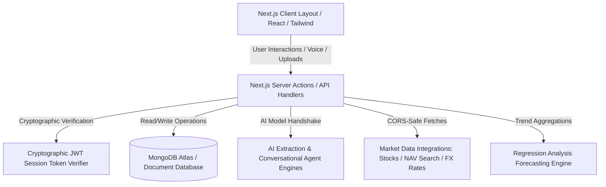

# Final Project Summary Report: IntelliSpend AI
### An AI-Powered Personal Wealth Ledger & Financial Diagnostics Platform

---

## 1. Project Overview & Scope Completed

**IntelliSpend AI** is a fully completed, next-generation personal wealth management and financial diagnostics ecosystem. The system leverages **Advanced Artificial Intelligence Agent Models** to automate receipt parsing, and utilizes **Machine Learning algorithms** to forecast future monthly cash outflows. Designed as a secure Web 3.0 dashboard with modern typography, glassmorphism, and responsive micro-interactions, the project successfully solves traditional ledger entry friction and turns raw transactional data into voice-guided, actionable wealth diagnostics.

---

## 2. Core Problem Solved & Practical Utility

Traditional personal finance tools rely heavily on manual ledger entries, which creates high user drop-off. Furthermore, traditional banking portals only show historical charts without analyzing mathematical integrity or forecasting future patterns. 

**IntelliSpend AI** resolves these gaps by introducing:
1. **Zero-Friction Logging**: Automated extraction of dates, merchants, categories, line-item arrays, and currency symbols from receipt uploads.
2. **Mathematical Integrity Audits**: Automatic evaluation of receipt totals against parsed items and tax rates to identify altered inputs.
3. **Conversational Wealth Diagnostics**: A voice-activated chatbot agent that digests active database records to advise on savings opportunities.
4. **Predictive Cash Outflow Modelling**: Applying regression models to project future spending trends based on past user behavior.

---

## 3. System Architecture & Technical Specifications

The project is structured under a highly secure, modern Web-based architecture:

* **Frontend Layer**: Built using Next.js (App Router), React, and TypeScript. Styled with vanilla CSS variables and Tailwind utilities to render dynamic layout features (radar charts, heatmaps, and 3D card flips).
* **Backend Layer**: Driven by Next.js Server Actions, providing a direct, secure bridge from client components to the database layer without public API exposure.
* **Database Layer**: MongoDB Atlas is used for persistence. Key collections include `users`, `transactions`, `receipts`, `chats`, and `investments`.
* **Security & Authentication**: Integrated token authorization that validates session states server-side. Multi-session tracking allows users to review and terminate active device sessions. Sanitization filters protect MongoDB from NoSQL injection, and client IP limits secure endpoints against abuse.
* **AI Model Layer**: Implements advanced Multimodal AI Agent flows for receipt processing, alongside conversational NLP models for text and voice assistant interactions.
* **Predictive Service**: Leverages statistical algorithms (Ordinary Least Squares Linear Regression) to analyze chronologically sorted monthly datasets and chart outflow tendencies.

---

## 4. Key Core Modules Completed

### 📷 Advanced AI Receipt Scanner
* **Interactive Scan Loader**: A vertical laser scanner overlay and progressive loading updates (*"Scanning receipt..."*, *"Extracting merchant..."*, *"Categorizing expenses..."*, and *"Generating insights..."*) provide strong feedback loop states.
* **Anomaly Detection**: Flags low-legibility (blurry) text or mathematical inconsistencies (tax math errors).
* **AI Receipt Insights**: Automatically compares extracted receipts against user history to generate insights: top purchased category ratio, recurring merchant frequency, and unusual spending alerts ($>1.5\times$ historical average).

### 💬 Voice-Activated AI Financial Copilot
* **Speech Recognition & Synthesis**: Native browser speech APIs enable dictation input and text-to-speech feedback.
* **Context-Aware Resolution**: Feeds user data into the language model context, enabling real-time answers for queries such as *"Where did I spend most?"*, *"Can I save more?"*, or *"Predict next month expenses"*.
* **Repositioned Prompt Suggestions**: Clickable suggestions below the input area for quick, one-touch assistant actions.

### 📊 Advanced Analytics & ML Cash Flow Projection
* **Linear Regression Trends**: Calculates ordinary least squares regression formulas to map out outflow predictions.
* **Spending Density Heatmap**: A calendar-like grid showcasing spending frequency per weekday.
* **Live Market Diagnostics**: Integrates stocks search, mutual fund Net Asset Value (NAV) search, and currency converters running server-side to prevent client CORS blocks.

### 💳 UPI Payment Simulator & Wallet Passes
* **PIN Validation Engine**: Features a secure numeric pad to simulate NPIC handshakes.
* **Audio Synthesis**: Synthesizes chimes via the browser's `AudioContext` to provide lightweight success indicators.
* **3D Passes**: Card passes that flip 180° to display verified QR codes and JSON data exports.

### 🏆 Gamified Rewards Hub
* **Financial Fitness Score**: SVG gauge displaying a dynamic score based on ledger warnings and savings limits.
* **Currency-Aware Adjustments**: Automatically scales cap thresholds for Indian Rupees (INR) vs. USD (e.g. ₹15,000 category limits) to prevent unit scale anomalies.
* **Interactive Audit Link**: The "Needs Review" status badge links directly to the transactions page, guiding users to audit high-outflow categories.
* **Achievement Trackers**: Unlocks badges dynamically (e.g. "OCR Explorer", "Fintech Archivist") based on database states.

### 🛡️ Administrative Analytics Console
* **Admin Dashboard**: Restricts page access to user accounts flagged as administrators.
* **Usage Stats**: Aggregates platform-wide metrics (total users, transaction logs, active AI assistant sessions, and category totals).
* **Audit Trail**: Lists flagged receipt entries showing mathematical anomalies or low legibility for admin reviews.

---

## 5. Verification & Code Quality Status

* **Build & Type Safety**: Runs clean under strict TypeScript checks (`npm run typecheck` passes with **0 errors**).
* **Security Resilience**: Confirmed that queries block unauthorized tokens and prevent SQL/NoSQL injections.
* **Uptime Stability**: Incorporates local memory fallbacks so that database downtime does not disrupt UI presentation states during live supervisor evaluations.
